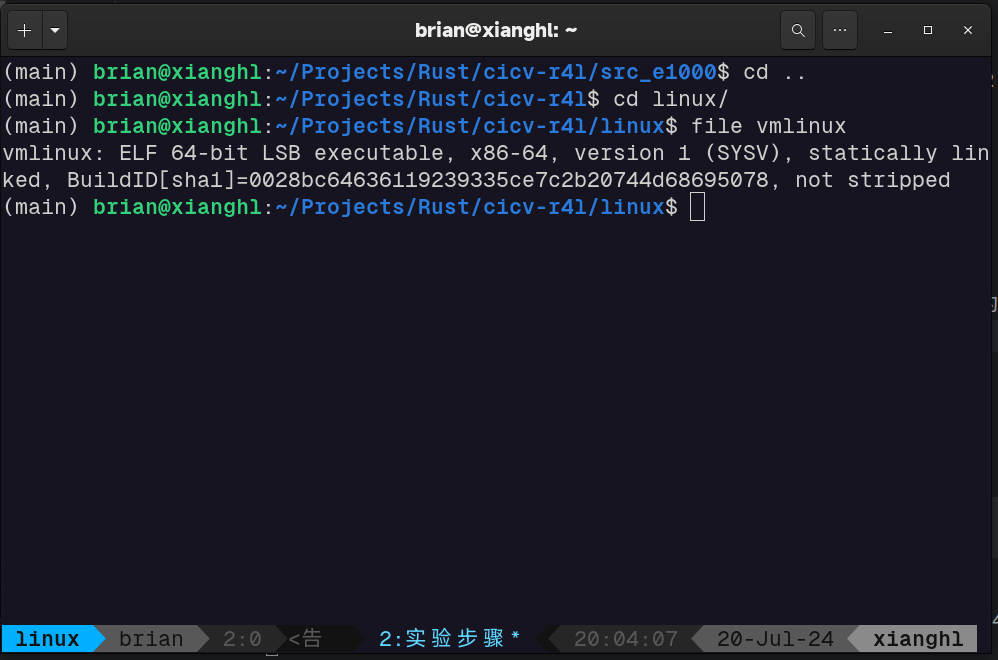
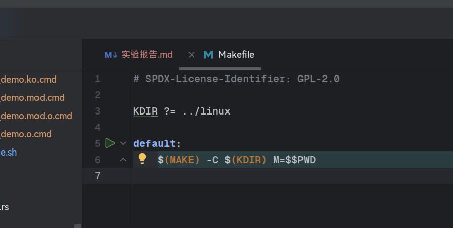
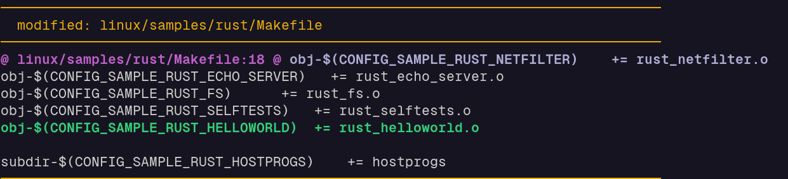
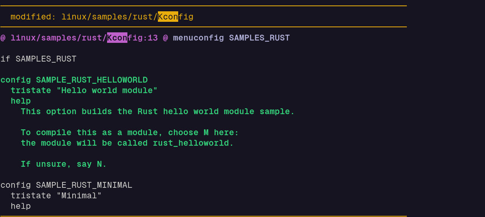
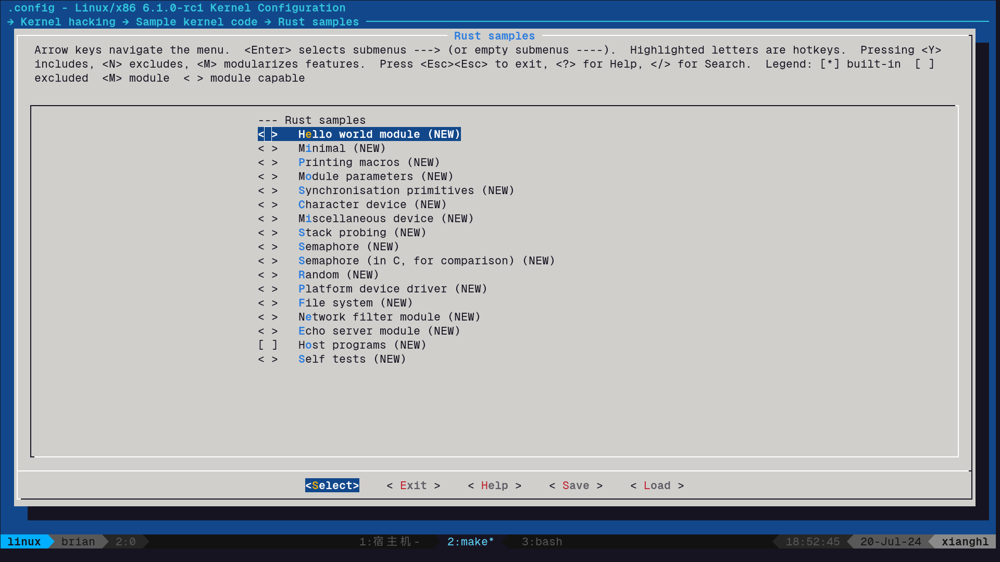
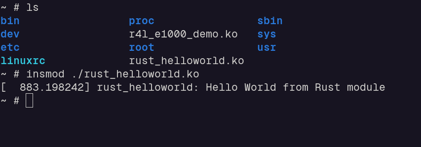
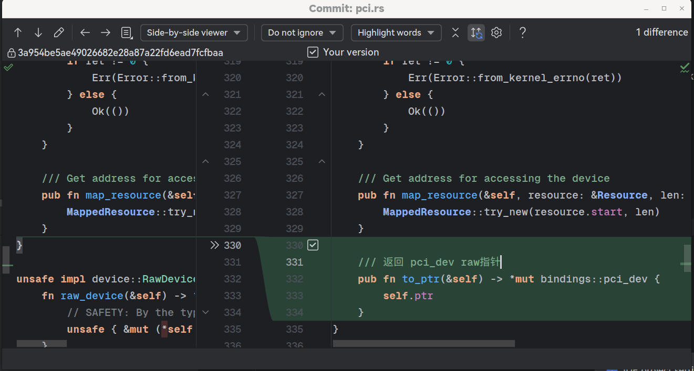
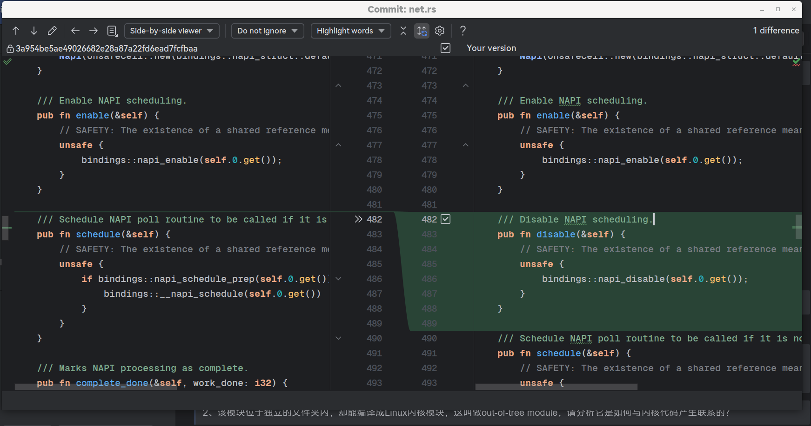
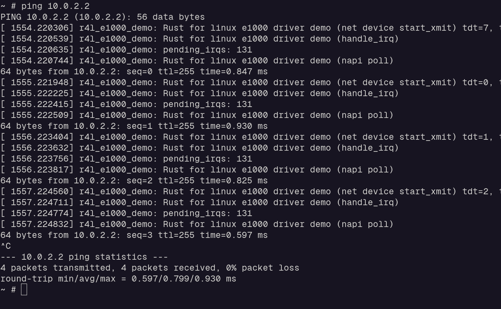
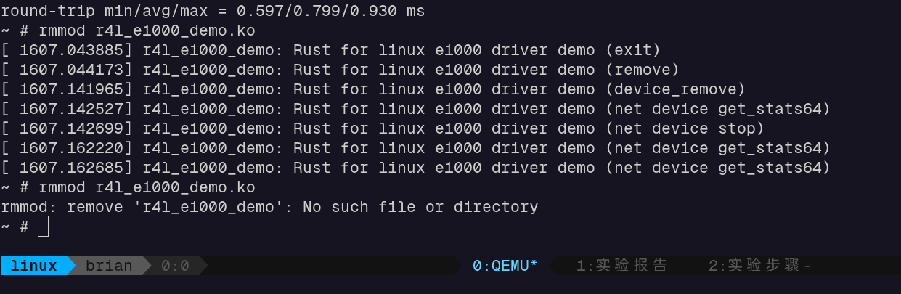

## 作业一

直接按照文档操作， 最终生成了vmlinux



问题记录：

编译e1000的时候发现clang和libclang版本不匹配，是因为我机器上有多个版本的clang. 
最后选用了clang-14.

## 作业二

编译部分略，最终是成功生成了 ko 文件

> 1、编译成内核模块，是在哪个文件中以哪条语句定义的？

肯定是在配置文件中指定的， `cat src_e1000/Kbuild` :

```makefile
# SPDX-License-Identifier: GPL-2.0

obj-m := r4l_e1000_demo.o
```

> 2、该模块位于独立的文件夹内，却能编译成Linux内核模块，这叫做out-of-tree module，请分析它是如何与内核代码产生联系的？

为了实现out-of-tree, 肯定是让外部模块主动去找 srctree. 所以只需要看 src_e1000/Makefile 就好：



## 作业三

添加rs代码 (图略)

修改Makefile 添加编译目标



修改Kconfig 添加menuconfig 项




回到linux目录下, 执行 `make LLVM=1 menuconfig -j32`, 配置路径：Kernel hacking > Sample kernel code > Rust samples



保存配置 重新编译内核 
将 helloworld 模块复制到虚拟机的rootfs中 启动qemu 验证模块：(成功安装)



## 作业四

需要修改linux/rust/kernel/pci.rs



修改linux/rust/kernel/net.rs



修改src_e1000/r4l_e1000_demo.rs
(图略)

重新编译内核和e1000, 启动qemu, 多次插拔测试， ping均没问题



移除ko:



